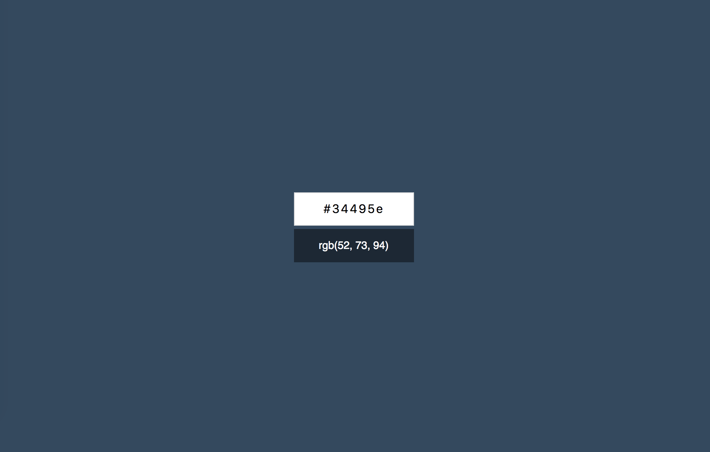

## [GitHub Page](https://efrem005.github.io/ra-forms-hex2rgb/)

Конвертер цветов из HEX в RGB
===

Вам необходимо разработать конвертер цветов из HEX в RGB.

## Интерфейс конвертера

При правильном вводе цвета он показывает его представление в формате RGB и меняет цвет фона на заданный:

Конвертер при вводе неправильного цвета в формате HEX должен сообщать об ошибке:

Необходимо дожидаться ввода всех семи символов, включая решётку, чтобы принимать решение о том, показывать ошибку или менять цвет фона.

Стили и пример разметки вы можете найти в папке [markup](./markup). Разметка дана для примера, вы можете реализовать её самостоятельно